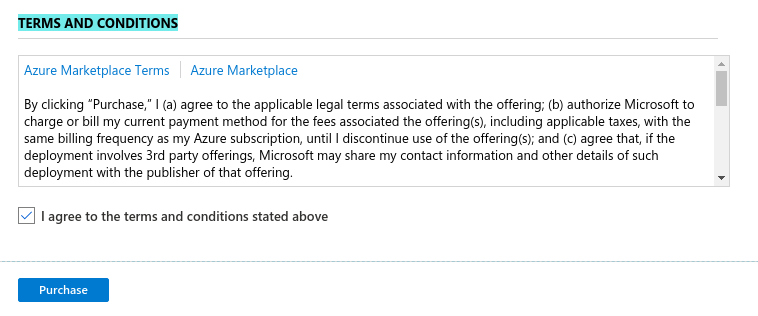

# User to Cloud Application Connection
This quickstart guide will provide all the steps to create a secure service between a user and an application hosted in Azure Cloud using NetFoundry Overlay Fabric (NFOF).

!!! important
    Assumption is that the [NF Fabric](../netfoundry/fabric.md) is already up and the [NF Client](../netfoundry/client.md) is installed.

## Create and install NF Client
This section will guide a user through the steps on how to createaal the  a client in the NF Console UI. Then, it will provide links to Guides on how to install the NetFoundry Client Software for Windows and MAC Clients, including the registration with the  NF Network Fabric.

!!! example "Console UI"
    1. Navigate to Manage Clients Page
    
    1. Click on + sign in the top right corner.
    1. Fill in the required information and click on "Create"
    
    1. Copy the Client Registration Key
    
    1. Install the NF Client Software by following the directions at the appropriate OS link
        1. [Window](https://support.netfoundry.io/hc/en-us/articles/360017535332-Install-a-NetFoundry-Client-on-Windows)
        1. [Mac](https://support.netfoundry.io/hc/en-us/articles/360016128692-Install-a-NetFoundry-Client-on-MacOS)

## Create and Install NF Azure Gateway
This section will guide a user through the steps on how to create a NF Manage Gateway in the NF Console UI and install it in the Azure vNet.

!!! example "Console UI"
    1. Navigate to Manage Gateways Page
    1. Click on + sign in the top right corner.
    
    1. Click on "Create Gateway" on the Azure Cloud Gateway Card
    
    1. Fill in the required information and click on "Create"
    
    1. Copy the Client Registration Key
    
    1. Click on "Deploy to Microsoft Azure". It will take you to the Azure Portal and ask you for your login credentials.
    1. You will be presented with the template that needs to be filled. The first section is the Basics regarding your Subscription and Resource Group this gateway will be deployed in.
    
    1. The second section related to resources associated with this gateway. e.g. vm name, ip address space, security groups, etc. you will paste the registration key copied in step 5. You will also need the public ssh key to use for access to this gateway remotely.
    
    1. You will need to agree to Azure Marketplace Terms and Conditions and click to "Purchase" to continue.
    
    1. If the NF Gateway was deployed successfully. Here is the view of the Resource Group and NF Conole UI.
    
    
    1. Done

## Create Service
This section will guide a user through the steps on how to create a NF Service.

!!! example "Console UI"
    1. Navigate to Manage Services Page under Manage Appwans
    1. Click on + sign in the top right corner.
    
    1. Click on "Create an IP Host Service"
    
    1. Fill in the required information for SSH and click on "Create"
    
    1. If successfully, the service is green.
    
    1. Done

## Create AppWan
This section will guide a user through the steps on how to create a NF Service.
