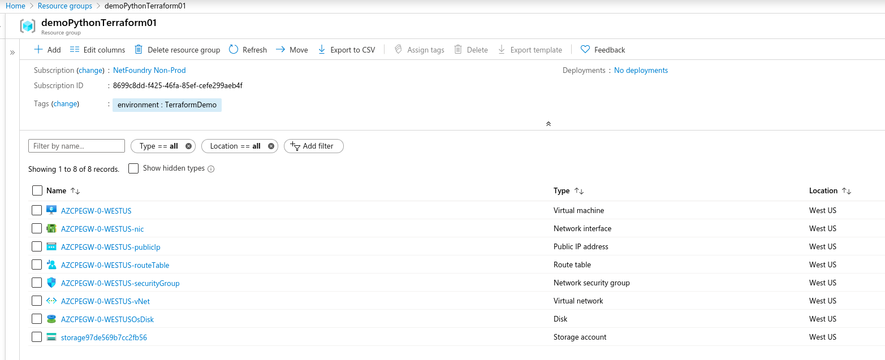
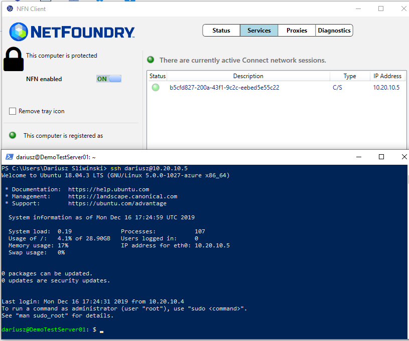

# Overview
This quickstart guide will provide all the steps to create a secure service between a user and an application hosted in Azure Cloud using NetFoundry Overlay Fabric (NFOF).

!!! important
    Assumption is that the [NF Fabric](../netfoundry/fabric.md) is already up and the [NF Client](../netfoundry/client.md) is installed.

## Through NF Web Console UI

{!common/install-nf-client.md!}

{!common/create-azure-gateway.md!}

{!common/create-ip-host-service.md!}

{!common/create-appwan.md!}

## Programmatically

### via REST API (Python)

!!! note
    For the code clarity, we have broken down the code into multiple Python modules  

    1. [NF REST CRUD (Create,Read, Update and Delete) operations](../python/nf_requests.py)
    1. [Get MOP Session Token](../python/nf_token.py)
    1. [Create NF Network](../python/nf_network.py)
    1. [Create NF Gateway(s)](../python/nf_gateway.py)
    1. [Create NF Service(s)](../python/nf_service.py)
    1. [Create NF AppWan(s)](../python/nf_appwan.py)
    1. [Wrapper Script to Create NF Resources based on Resource yaml file](../python/nf_resources.py)

    Environment Setup needed:

    1. [~/.env](../../python/env) to store NF Credentials in (e.g. `clientId, clientSecret`) to obtain a session token for NF API

    1. Export Azure Credentials (e.g, `export ARM_TENANT_ID, ARM_CLIENT_ID, ARM_CLIENT_SECRET, ARM_SUBSCRIPTION_ID`) to enable resource gateway creation in Azure Resource Group via Terraform.

    Additional Information:

    1. The new Resource Group in Azure is created based on then name provided in [Resource yaml](../python/nf_resources.yml), if one does not exists already in the same region (e.g. centralus). The action delete gateway will delete the RG as well even if it was an existing RG. If one does not want to delete the RG, the command `terraform state rm "{tf resource name for RG}"` needs to be run before running the gateway delete step. This will ensure that the RG is not deleted.
    1. A new vNet will be created and NF Gateway will be placed in it.
    1. Environment means the NF Console Environment used (e.g. production), not Azure.

!!! example "via REST API (Python)"
    1. Clone this repo (git clone https://github.com/netfoundry/mop.git)
    1. Update [Resource yaml](../python/nf_resources.yml) file with the desired options to feed into the wrapper script as described
    in the following code snippet.
    [All Resource.yml Options](README.md)
    1. Run this from the root folder to create GW in NF Console UI and Azure.
    ``` python
    python3 quickstarts/docs/python/nf_resources.py --file quickstarts/docs/python/nf_resources.yml
    ```
    Required Configuration Parameters for Gateway Creation
    ``` yaml
    environment: production
    network_action: get
    network_name: DemoNet01
    gateway_list:
    - action: create
      cloud: azure
      count: 1
      names: []
      region: westus
      regionalCidr: [10.20.10.0/24]
      regkeys: []
      resourceGroup:
        name: demoPythonTerraform01
        region: centralus
      tag: TerraformDemo
    terraform:
      bin: terraform
      output: 'no'
      source: ./quickstarts/docs/terraform
      work_dir: .
    ```
    1. After the script is run successfully, one can see that the gateway name and registration key were saved in Resource.yml file. The name is created automatically based on region and gateway type joined with x and gateway count (AZCPEGW means an azure type gateway in NF console). One can create more than one gateway in the same region by increasing the count to more than 1.
    ``` yaml
    environment: production
    gateway_list:
    - action: create
      cloud: azure
      count: 1
      names:
      - AZCPEGWx0xWESTUS
      region: westus
      regionalCidr:
      - 10.20.10.0/24
      regkeys:
      - 21DB86724EC3F31C11C1C9D68CE5ECD6A06F057E
      resourceGroup:
        name: demoPythonTerraform01
        region: centralus
      tag: TerraformDemo
    network_action: get
    network_name: DemoNet01
    terraform:
      bin: terraform
      output: 'no'
      source: ./quickstarts/docs/terraform
      work_dir: .
    ```
    
    
    1. Create a test server vm on the same vNet if not already present.
    
    1. Update the Resoure.yaml file to include the Service option to create the NF service on the gateway create in the previous step. Don't forget to change the action on the gateway to "get".
    ``` yaml
    environment: production
    gateway_list:
    - action: get
      cloud: azure
      count: 1
      names:
      - AZCPEGWx0xWESTUS
      region: westus
      regionalCidr:
      - 10.20.10.0/24
      regkeys:
      - 21DB86724EC3F31C11C1C9D68CE5ECD6A06F057E
      resourceGroup:
        name: demoPythonTerraform01
        region: centralus
      tag: TerraformDemo
    network_action: get
    network_name: DemoNet01
    terraform:
      bin: terraform
      output: 'no'
      source: ./quickstarts/docs/terraform
      work_dir: .
      services:
      - action: create
        gateway: AZCPEGWx0xWESTUS
        ip: 10.20.10.5
        port: 22
        name:
        type: host
    ```
    1. After the script run again successfully, the service section should have been populated with the service name as so.
    ``` yaml
    services:
    - action: create
      gateway: AZCPEGWx0xWESTUS
      ip: 10.20.10.5
      name: AZCPEGWx0xWESTUS--10.20.10.5--22
      port: 22
      type: host
    ```
    
    1. Create a client endpoint if not already done so.
    
    1. Update the Resoure.yaml file to include the AppWan option to create the NF AppWan tying the gateway, client and service created in the previous steps. Don't forget to change the action on the service option to "get".
    ``` yaml
    environment: production
    gateway_list:
    - action: get
      cloud: azure
      count: 1
      names:
      - AZCPEGW-0-WESTUS
      region: westus
      regionalCidr:
      - 10.20.10.0/24
      regkeys:
      - 21DB86724EC3F31C11C1C9D68CE5ECD6A06F057E
      resourceGroup:
        name: demoPythonTerraform01
        region: centralus
      tag: TerraformDemo
    network_action: get
    network_name: DemoNet01
    services:
    - action: get
      gateway: AZCPEGW-0-WESTUS
      ip: 10.20.10.5
      name: AZCPEGWx0xWESTUS--10.20.10.5--22
      port: 22
      type: host
    terraform:
      bin: terraform
      output: 'no'
      source: ./quickstarts/docs/terraform
      work_dir: .
    appwans:
    - action: create
      endpoints:
      - AZCPEGW-0-WESTUS
      - DemoClient01
      name: appwan-ssh-22
      services:
      - AZCPEGWx0xWESTUS--10.20.10.5
    ```
    1. After the script ran again successfully, the connectivity should have been up.
    
    1. To test connectivity, log in to the DemoClinet01 and run ssh "username"@"privateIp"
    
    1. To delete resources created, just follow the reverse order. Change the action to delete for AppWans first, then other resource as indicated in the code snippets.
    ``` yaml
    appwans:
    - action: delete
      endpoints:
      - AZCPEGWx0xWESTUS
      - DemoClient01
      name: null
      services:
      - AZCPEGWx0xWESTUS--10.20.10.5--22
    ```
    1. Then services
    ``` yaml
    services:
    - action: delete
      gateway: AZCPEGWx0xWESTUS
      ip: 10.20.10.5
      name: null
      port: 22
      type: host
    ```
    1. Endpoints - will delete all resources in Azure as well.
        1. `terraform state rm "{tf resource name for RG}" // run this before the python script if Resource Group needs to be preserved`
        1. 
    ``` yaml
    gateway_list:
    - action: delete
      cloud: azure
      count: 1
      names: []
      region: westus
      regionalCidr:
      - 10.20.10.0/24
      regkeys: []
      resourceGroup:
        name: demoPythonTerraform01
        region: centralus
      tag: TerraformDemo
    ```
    1. Network
    ``` yaml
    environment:  production
    network_action: delete
    network_name: DemoNet01
    ```
    1. Done
