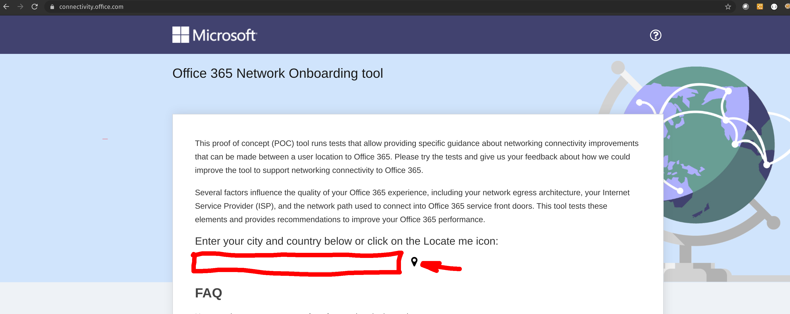
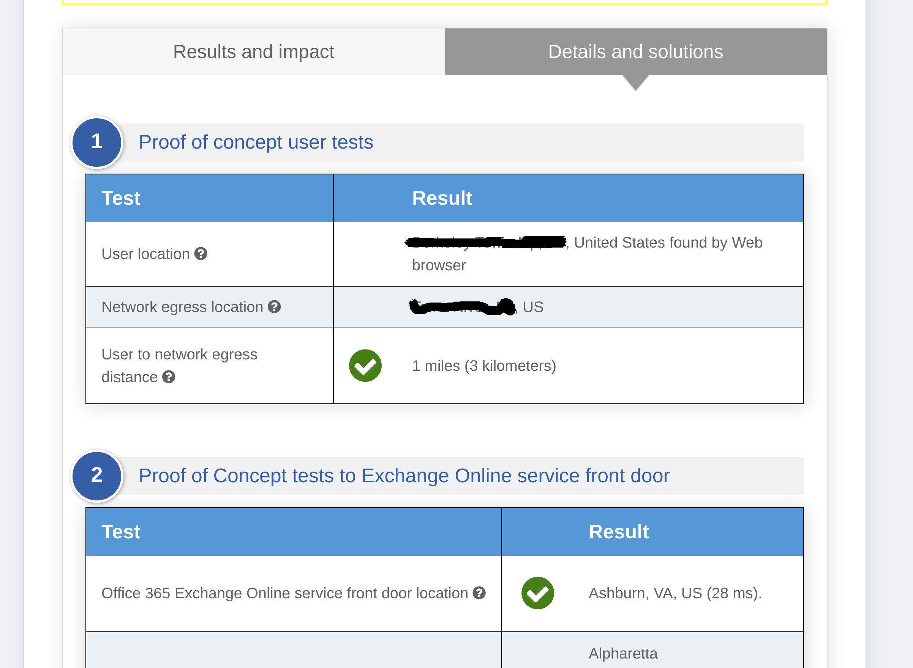
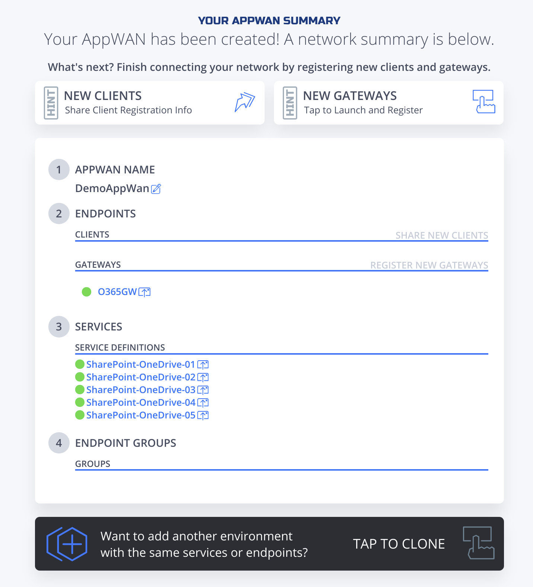

# Overview
We will guide users how to deploy a NF Gateway to optimize the connectivity
to Microsoft O365 Services. The services that will be optimized are
share-point and one-drive

Microsoft deployed content delivery network (CDN), where they offer many entry points around the World to access Office
365 Services like sharepoint, onedrive, etc. By providing these "front doors" (also known as) to O365 services, MS wanted to improve user experience by optimizing reach-ability and access. With that in mind, Microsoft is pushing Enterprises to utilize this CDN by creating O365 bypass at the edge of the Enterprise Network. The bypass is a configuration change, where a policy routing is enforced to allow the 0365 services to be short circuited to the Internet. The idea is to avoid going through a central location, where all content is inspected and checked for security threats before released to World Wide Web.

NetFoundry Edge has the ability to provide such bypass if desired, but in this Quickstart we are showing how our customers can configure NF Network to complement the MS CDN, utilize their optimization and still keep using NF Secure tunnels for connectivity.

## Find the Closest Front Door
Microsoft created an online tool to test from user's location, where the best entry to their Network is. Please open a browser on your windows computer and type the following url https://connectivity.office.com/.

As it is stated there, click on the location icon. Once the test is finished, it will show where the closest location is.





In our example, the user's closest location is Ashburn, VA (Azure USEAST).

!!! note "Select Region"
    Make sure you replace "Your Region" with the location of Azure DC given
    by the location tool.

    Most of the time, our Orchestration Platform will optimize the network to provide direct connectivity from where you are and Azure GW you are about to create.
    We will test if that is the case. We continuously update our optimization algorithm to pick the best path all the time based on ongoing data collection and feedback from the network fabric.

## Through NF Web Console UI

{!common/create-azure-gateway.md!}

!!! note "Create SharePoint & OneDrive Services"
    Once can find the ip address that are allocated by Microsoft for SharePoint and OneDrive service.
    [Click on this link and write them down](https://docs.microsoft.com/en-us/office365/enterprise/urls-and-ip-address-ranges#sharepoint-online-and-onedrive-for-business)

    We only required  to use "Optimize Required" (ID 31), and they are 13.107.136.0/22, 40.108.128.0/17, 52.104.0.0/14, 104.146.128.0/17, 150.171.40.0/22.
    Create 5 services by repeating the next section for each of them. Replace Network Address in Step 4 with the ones above and Intercept Ports with 80, 443.

{!common/create-ip-network-service.md!}

All services configured.


{!common/create-appwan-gateway.md!}

AppWan successfully configured would look like this.



{!common/install-nf-client.md!}
    1. Add this Endpoint to the AppWan
    1. Once endpoint is added to the AppWan, here is what the services tab should look like.
    

## Programmatically

### Create via Python and Terraform

{!common/python-module-note.md!}

{!common/azure-environment-setup-note.md!}

!!! example "Steps"
    1. Clone this repo (git clone https://github.com/netfoundry/mop.git)
    1. Change directory to mop: ```cd mop```
    1. Update ```quickstarts/docs/api/python/etc/nf_resources.yml``` as so:
    ``` yaml
    environment: production
    network_action: create
    network_name: NetworkO365
    gateway_list:
    - action: create
      cloud: azure
      count: 1
      names:
      - GATEWAY-O365-01
      region: "region found by the connectivity test, e.g. eastus"
      regionalCidr:
      - 10.20.10.0/24
      regkeys: []
      resourceGroup:
        name: "you resource RG Name"
        region: "region of your RG"
      tag: null
    services:
    - action: create
      gateway: GATEWAY-O365-01
      name: SharePointOneDrive01
      netCidr: 22
      netIp: 13.107.136.0
      type: network
    - action: create
      gateway: GATEWAY-O365-01
      name: SharePointOneDrive02
      netCidr: 17
      netIp: 40.108.128.0
      type: network
    - action: create
      gateway: GATEWAY-O365-01
      name: SharePointOneDrive03
      netCidr: 14
      netIp: 52.104.0.0
      type: network
    - action: create
      gateway: GATEWAY-O365-01
      name: SharePointOneDrive04
      netCidr: 17
      netIp: 104.146.128.0
      type: network
    - action: create
      gateway: GATEWAY-O365-01
      name: SharePointOneDrive05
      netCidr: 22
      netIp: 150.171.40.0
      type: network
    appwans:
    - action: create
      endpoints: []
      name: AppWanSharepoint
      services:
      - SharePointOneDrive01
      - SharePointOneDrive02
      - SharePointOneDrive03
      - SharePointOneDrive04
      - SharePointOneDrive05
    terraform:
      bin: terraform
      output: 'no'
      source: ./quickstarts/docs/terraform
      work_dir: .
    ```
    1. Run this from the root folder (mop) to create network, gateway, services, and appwan throuhg NF API
    and deploy Virtual Machine to host NF Gateway in your Azure RG.
    ``` python
    python3 quickstarts/docs/api/python/source/netfoundry/nf_resources.py --file quickstarts/docs/api/python/etc/nf_resources.yml
    ```
    1. Run this command if to keep RG (replace "RG Region" with your RG's region, e.g. centralus)
    ```
    terraform state rm module."RG Region"_rg.azurerm_resource_group.terraformgroup
    ```
    1. Once the script is finished, all the resources in NF Console and Azure RG will have been deployed.

    !!! note
        If something went wrong, please check logoutput.txt file generated in the root directory for details on any errors that may have occurred during the deployment.

### Create Windows Client via Powershell
{!api/powershell/getting-started.md!}
    1. Once you download the PS script onto your laptop, run the following in the directory containing the script:
    ```
    .\NF-powershell.ps1
    ```
    1. Update the following section of the resources.yaml file referenced at the beginning of the last section.
    ``` yaml
    appwans:
    - action: create
      endpoints:
      - "your endpoint name"
    ```
    1. Run resources.py script to add the newly created endpoint to the same AppWan.
    ``` python
    python3 quickstarts/docs/api/python/source/netfoundry/nf_resources.py --file quickstarts/docs/api/python/etc/nf_resources.yml
    ```
    1. Once endpoint is added to the AppWan, here is what the services tab should look like.
    

## Performance Testing

!!! example "Verifying the performance through testing"
    !!! Note
        Recommended way of accessing Ondrive is through the Windows App with File Explorer. If access to OneDrive is required using a browser than Firefox is recommended by NetFoundry to get best performance.

    1. Map your Business OneDrive to your local file system if not already done so.
    1. Make sure the NF App is enabled.
    1. Transfer large files between remote and local drive to test the performance.
    1. Disable the NF App and repeat the previous step to compare the performance.
    1. The anaconda-navigator
    1. The performance should be at least the same if not better.

## Programmatically

### Delete via Python and Terraform

!!! example "Steps"
    1. Change all actions to delete in ```quickstarts/docs/api/python/etc/nf_resources.yml``` as so:
    ``` yaml
    environment: production
    network_action: delete
    network_name: NetworkO365
    gateway_list:
    - action: delete
      cloud: azure
      count: 1
      names:
      - GATEWAY-O365-01
      region: eastus
      regionalCidr:
      - 10.20.10.0/24
      regkeys: []
      resourceGroup:
        name: RG_O365_Demo
        region: centralus
      tag: null
    services:
    - action: delete
      gateway: GATEWAY-O365-01
      name: SharePointOneDrive01
      netCidr: 22
      netIp: 13.107.136.0
      type: network
    - action: delete
      gateway: GATEWAY-O365-01
      name: SharePointOneDrive02
      netCidr: 17
      netIp: 40.108.128.0
      type: network
    - action: delete
      gateway: GATEWAY-O365-01
      name: SharePointOneDrive03
      netCidr: 14
      netIp: 52.104.0.0
      type: network
    - action: delete
      gateway: GATEWAY-O365-01
      name: SharePointOneDrive04
      netCidr: 17
      netIp: 104.146.128.0
      type: network
    - action: delete
      gateway: GATEWAY-O365-01
      name: SharePointOneDrive05
      netCidr: 22
      netIp: 150.171.40.0
      type: network
    appwans:
    - action: delete
      endpoints: []
      name: AppWanSharepoint
      services:
      - SharePointOneDrive01
      - SharePointOneDrive02
      - SharePointOneDrive03
      - SharePointOneDrive04
      - SharePointOneDrive05
    terraform:
      bin: terraform
      output: 'no'
      source: ./quickstarts/docs/terraform
      work_dir: .
    ```
    1. Run this from the root folder (mop) to delete network, gateway, services, and appwan through NF API
    and destroy Virtual Machine hosting NF Gateway in your Azure RG.
    ``` python
    python3 quickstarts/docs/api/python/source/netfoundry/nf_resources.py --file quickstarts/docs/api/python/etc/nf_resources.yml
    ```
