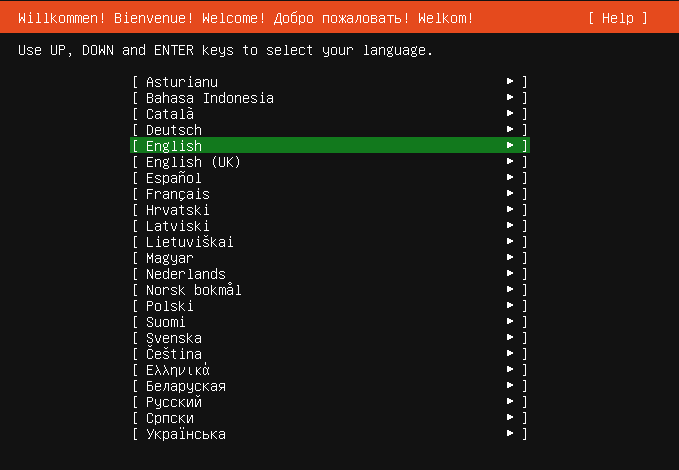
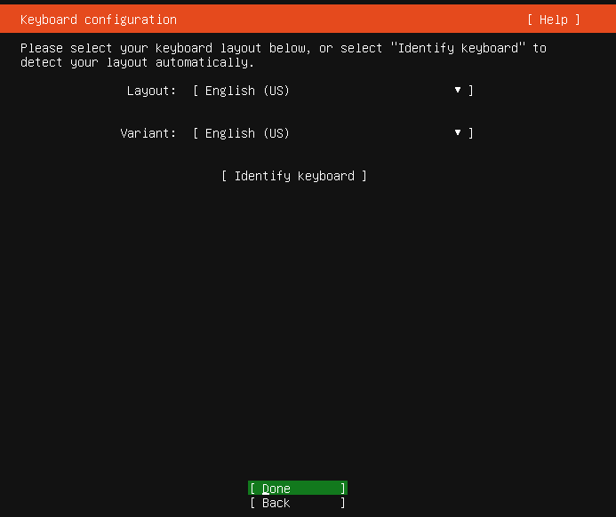
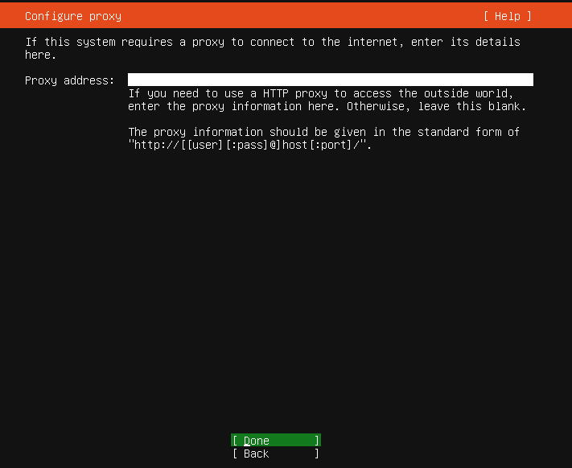
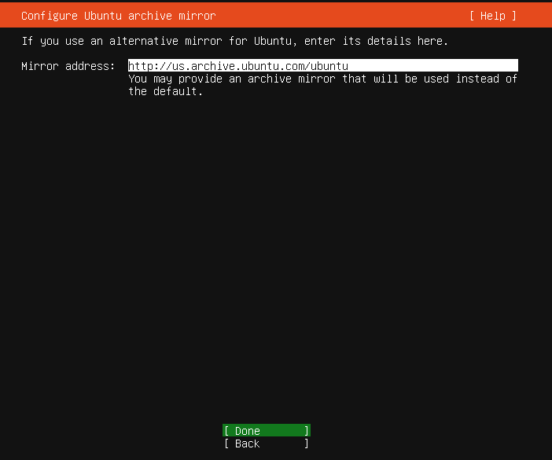

# SuperMicro (UCPE) setup

Follow this guild to setup the SuperMicro box for use with V7 network. The OS for this white box will be Ubuntu 20.04

# 1. Introduction

We have not decided how to deliver our installation media to the customer yet.  That will be determined later on based on the system integrator we pick.

There are three approaches on how to deliver the image.
<li>Build a installation media with Cubic. Ship the installation media to the integrtor.
<li>Create an ansible image for the integrator.
<li>Create an golden image for the integrator.

#2. Cubic Approach

##2.1 General info

With the Cubic approach, the customer get a modified Ubuntu 20.04 installation image. This section is going to cover how to create that image. The image will not be CIS hardened.  The CIS hardening script renders the installation image useless.  The CIS hardening will need to be called via cloudinit after the installation, which makes the installation process much longer. So this approach is not desireable. 

##2.2 Obtain the installation media and create installation USB

The Cubic requires GUI to run, so the installation ISO can be the desktop version of the Ubuntu20.04.  But the installation ISO we going to create is based on the server version, so we going to cover the steps based on Ubuntu 20.04 server installation.

This document is not going to cover how to create USB installtion stick.

##2.3 Install Ubuntu 20.04 server on Supermicro

Before your installation starts, make sure you connect the ethernet cable to the first interface on the box.  This will make setup the interface a little easier.

Boot up the installation media and start the installation. 


<br>Choose the default "English" language or choose your desired language.


<br>Choose "Continue without updating".


<br>Keep the default keyboard layout or choose your keyboard layout (for different language)


<br>On the Network interface page, if the interface is connected, you should see an IP address assigned automatically.  If you need to assign an manual IP, you can do so now.  Please write down the IP address, you will need that for the later steps.


<br>Skip the Proxy address if you don't use proxy.


<br>Keep the default Mirror address and continue


<br>Use the entire disk (the dafault) for installation.


<br>Hit continue to confirm the selection


<br>Choose your username and server name. Write down the user name. We will need the user name to login to the system to do future configuration.


<br>Enable "Install OpenSSH server" for remote access to the server.


<br> Skip the snaps selection and continue.


<br> Now system will go into installation and update of the security package. It will take few minutes to finish.


<br> When the installation completes, you can reboot the server.

##2.4 Install GUI
ssh into the box by using the IP address obtained above.  Install the GUI and cubic

```
ssh ziggy@192.168.1.63
ziggy@192.168.1.63's password: 
> sudo apt update
> sudo apt install tasksel
> sudo tasksel install ubuntu-desktop
> sudo apt-add-repository ppa:cubic-wizard/release
> sudo apt install cubic
```

Restart the box and login from the graphic terminal.
```
> sudo shutdown -r 0
```


##2.5 Generate custom installer using Cubic

Copy Ubuntu 20.04 server image (ISO) into the box. If you have the image already, you can simply scp into the box.  Or you can download it again into your box by using firefox browser.

```
> scp ubuntu-20.04.1-live-server-amd64.iso ziggy@192.168.1.63:
ziggy@192.168.1.63's password: 
ubuntu-20.04.1-live-server-amd64.iso                                 100%  914MB  96.2MB/s   00:09    
```

Copy setup ansible playbook to the box.
```
> scp supermicro_playbook.tgz ziggy@192.168.1.63:
ziggy@192.168.1.63's password: 
supermicro_playbook.tgz                                              100%  147KB  24.4MB/s   00:00    
```

Start the Cubic on the desktop.


Create a directory (cubic1) to save the custom image


Choose the Ubuntu 20.04 server image. (Rest of the fields will fill themselves)


Once the image is decompress, you will see a "Custome Ubuntu ISO Creator" window.
Copy the supermicro ansible tarball into the that window.
then do the following commands:

```
> sudo apt install ansible
> tar xf supermicro_playbook.tgz 
> cd supermicro_playbook
> ansible-playbook -i hostfile ubbox.yml 
```

Once the ansible succesfully ran (if it is not successful, you can rerun it again), you can delete the playbook.

```
> cd
> rm -rf supermicro_playbook
> rm -rf supermicro_playbook.tgz
```

Hit Next on Cubic window and generate the installation image.


#3 Create Ansible playbook for integrator

Follow section 2.3 to install Ubuntu 20.04 on the system.

Then copy the ansible playbook to the system.
```
> scp supermicro_playbook.tgz ziggy@192.168.1.63:
```

Login to the system.
```
> ssh ziggy@192.168.1.63
```

Perform the following command to run the playbook.
```
> tar xf supermicro_playbook.tgz 
> cd supermicro_playbook/
> sudo apt install ansible
> sudo su
> ansible-playbook -i hostfile ubbox.yml 
```

!!! NOTE
    If the default username (ziggy) changes, we will need to update the ansible-playbook accordingly.

#4 Create an golden image for the integrator

Follow steps in section 3 to setup the box.

Use a live CD (for example Fedora LiveCD) to bootup the system.  This ensures the Ubuntu 20.04 installation disk is not the running disk of the OS. We also need another USB stick to save the image (the live CD most likely will have a READ only system).  

After boot up the system with the live CD, open a terminal windows and check what disks are on the system.

```
$ lsblk
NAME                  MAJ:MIN RM   SIZE RO TYPE MOUNTPOINT
sda                     8:0    1  14.5G  0 disk 
└─sda1                  8:1    1  14.5G  0 part /run/initramfs/live
sdb                     8:16   1  28.9G  0 disk 
└─sdb1                  8:17   1  28.9G  0 part /run/media/liveuser/ADATA UFD
loop0                   7:0    0    12K  1 loop 
loop1                   7:1    0   1.8M  1 loop 
└─live-osimg-min      253:3    0     6G  1 dm   
loop2                   7:2    0   1.3G  1 loop 
loop3                   7:3    0     6G  1 loop 
├─live-rw             253:1    0     6G  0 dm   /
├─live-base           253:2    0     6G  1 dm   
└─live-osimg-min      253:3    0     6G  1 dm   
loop4                   7:4    0   512M  0 loop 
└─live-rw             253:1    0     6G  0 dm   /
nvme0n1               259:0    0 238.5G  0 disk 
├─nvme0n1p1           259:1    0   512M  0 part 
├─nvme0n1p2           259:2    0     1G  0 part 
└─nvme0n1p3           259:3    0   237G  0 part
  └─ubuntu--vg-ubuntu--lv  
                      253:0    0 118.5G  0 lvm 
```

As you can see, the "sda1" is the liveCD.  "sdb1" is the USB disk for image.  And "nvme0n1" is the internal disk that has our Ubuntu20.04 installed on.

Now, let's mount the "sdb1" and dump image into it. (Note, the image will be compressed to save disk storage.

```
$ mkdir outdisk
$ sudo mount /dev/sdb1 outdisk
$ cd outdisk/
$ sudo dd if=/dev/nvme0n1 |bzip2 --best >image.bz2
500118192+0 records in
500118192+0 records out
256060514304 bytes (256 GB) copied, 2268.42 s, 113 MB/s
$ ls -l
total 1942912
-rw-r--r--. 1 liveuser liveuser 1989533754 Nov 18 12:47 image.bz2
```

!!! Summary
    The "image.bz2" will be shipped to the integrator to burn into their units.

#4 Procedure for burning the produced image
This section describe a way to burn the UCPE with the image produced in section 3.

Bootup the liveCD with the image USB inserted into the unit.

Open a terminal. And perform the follwing.  (Please note, the "status=progress" is optional, but it does give good indication where the process is at the moment you monitor the action.


```
$ mkdir imagedisk
$ sudo mount /dev/sdb1 imagedisk
$ bunzip2 -c image.bz2 | sudo dd of=/dev/nvme0n1 status=progress
256045675008 bytes (256 GB) copied, 4797.524047 s, 53.4 MB/s
500118192+0 records in
500118192+0 records out
256060514304 bytes (256 GB) copied, 4798.08 s, 53.4 MB/s
```
