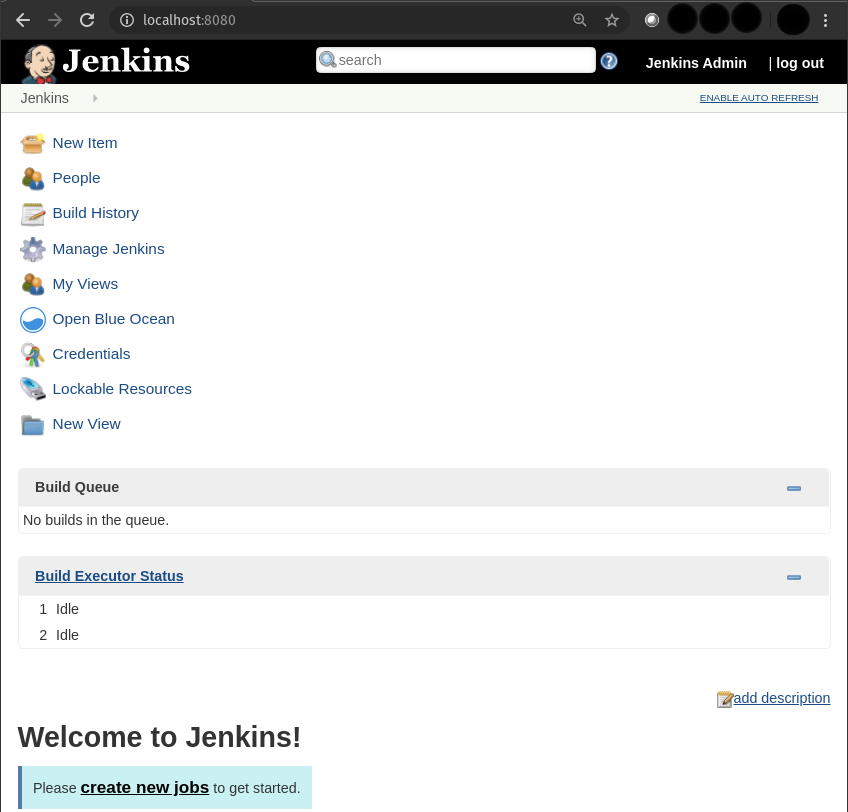

!!! info "Jenkins Requirements"
    1. [java](https://jenkins.io/doc/administration/requirements/java/)
    1. [docker](https://docs.docker.com/get-docker/)

    Then follow [jenkins installation using docker](https://jenkins.io/doc/book/installing/#installing-docker) to install Jenkins on the localhost and choose "Install suggested plugins". After successful installation, one should be able to reach the [Jenkins Dashboard](http://localhost:8080) (8080 is default port).
    

!!! example "Setting Up Jenkins Pipeline"
    1. Login to Jenkins
    1. Click on " New Item"
    
    1. Name you Project, select pipeline option and click "Ok"
    
    1. In the pipeline details, fill in the scm details as seen in the image below and click "Save".
    Everything default apart from:
        1. Repository Url: https://github.com/netfoundry/mop.git
        1. Script Path: pipeline/netfoundrydeploy2cloud.jenkinsfile
    
    1. Set up users for Azure API and NF MOP API access --
    [More on Credentials setup](https://jenkins.io/doc/book/using/using-credentials/)
    
    1. Run Jenkinsjob
