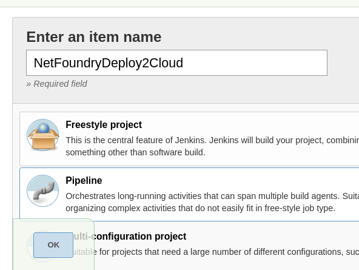
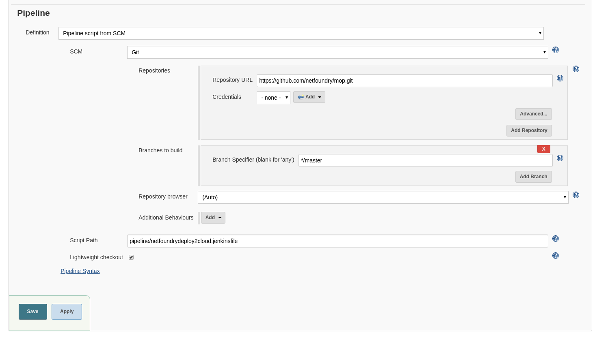
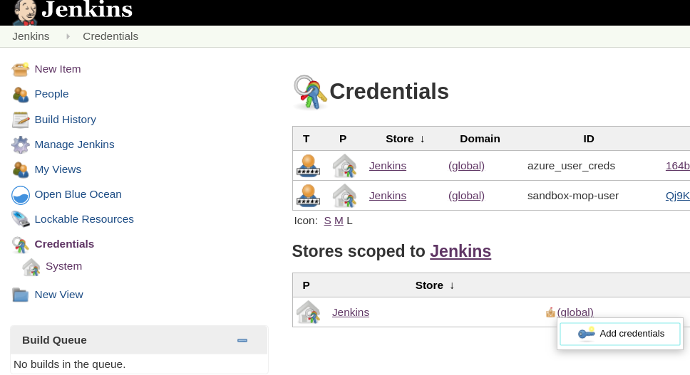
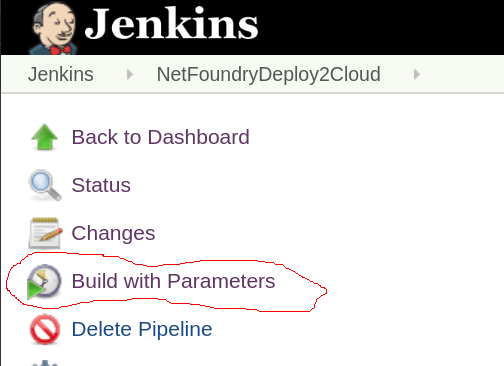
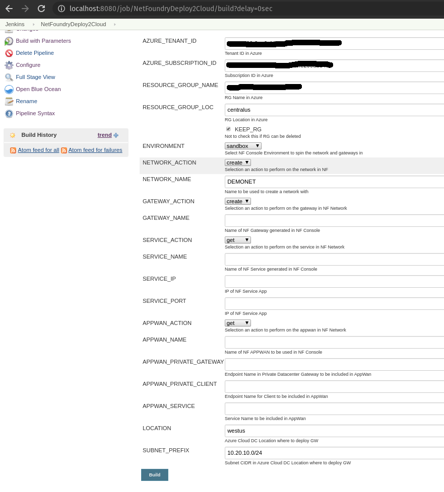
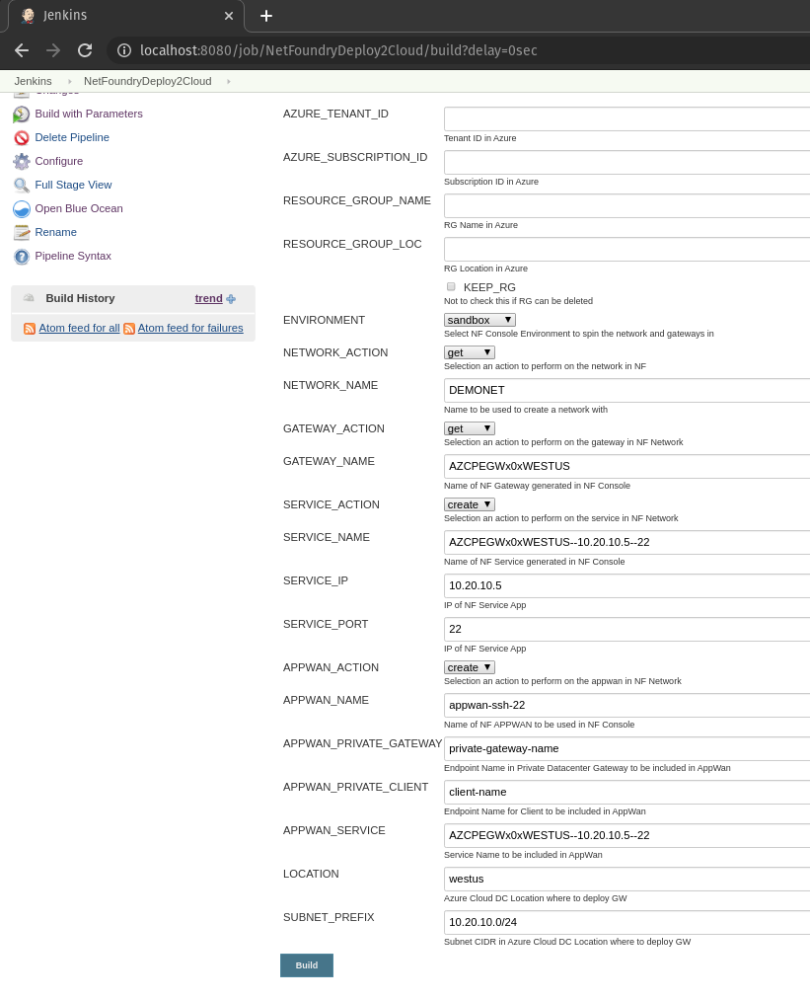
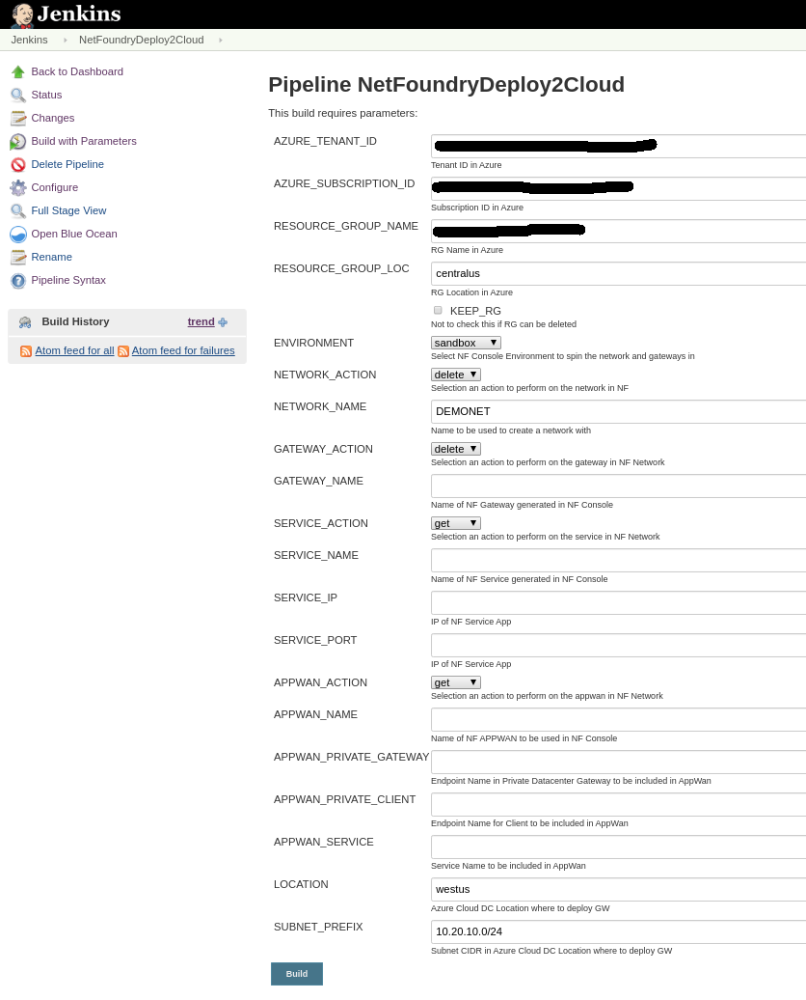

!!! info "Jenkins Requirements"
    1. [java](https://jenkins.io/doc/administration/requirements/java/)
    1. [docker](https://docs.docker.com/get-docker/)

    Then follow [jenkins installation using docker](https://jenkins.io/doc/book/installing/#installing-docker) to install Jenkins on the localhost and choose "Install suggested plugins". After successful installation, one should be able to reach the [Jenkins Dashboard](http://localhost:8080) (8080 is default port).
    

!!! Note
    If one wants to add the gateway deployed in the Private DataCenter and/or NF Client, it must be created prior to running the next steps.
    Otherwise the options of APPWAN_PRIVATE_GATEWAY and APPWAN_PRIVATE_CLIENT can be left blank and added after the appwan is created using
    the steps described in the Console UI section above. GATEWAY_NAME and SERVICE_NAME are automatically generated by the scripts in this version.
    GATEWAY_NAME = "GW TYPE"+x0x+"LOCATION OF AZURE GW", e.g. AZCPEGWx0xWESTUS; SERVICE_NAME = "GW NAME"--"SERVICE IP"--"SERVICE PORT",
    e.g. AZCPEGWx0xWESTUS--10.20.10.5--22.

!!! example "Setting Up Jenkins Pipeline"
    1. Login to Jenkins
    1. Click on " New Item"
    
    1. Name you Project, select pipeline option and click "Ok"
    
    1. In the pipeline details, fill in the scm details as seen in the image below and click "Save".
    Everything default apart from:
        1. Repository Url: https://github.com/netfoundry/mop.git
        1. Script Path: pipeline/netfoundrydeploy2cloud.jenkinsfile
    
    1. Set up users for Azure API and NF MOP API access --
    [More on Credentials setup](https://jenkins.io/doc/book/using/using-credentials/)
    
    1. Run Jenkinsjob by selecting on the pipeline created in the previous step. Click on "Build with Parameters"
    

!!! example "To create the resources"
    1. Fill in the Azure Details and select the following:
        1. NF Environment, e.g. production
        1. NETWORK_ACTION - create
        1. NETWORK_NAME, e.g. DEMONET
        1. GATEWAY_ACTION - create
        1. If Azure RG needs to be preserved, then KEEP_RG option must be left checked.
        1. LOCATION, e.g. westus - location where the Azure GW will be deployed in
        1. SUBNET_PREFIX, e.g. 10.20.10.0/24 - the subnet used for the vNet in the location of the Azure GW deployment.
    

    1. Run Jenkins job again by selecting on the pipeline created in the previous step. Click on "Build with Parameters"
    1. Fill in service and appwan details by selecting the following:
        1. KEEP_RG - not selected
        1. NF Environment, e.g. production
        1. SERVICE_ACTION - create
        1. APPWAN_ACTION - create
        1. GATEWAY_NAME, e.g. AZCPEGWx0xWESTUS (this is created in the previous step automatically)
        1. SERVICE_NAME, e.g. AZCPEGWx0xWESTUS--10.20.10.5--22 (this is created automatically during this step)
        1. SERVICE_IP, e.g. 10.20.10.5
        1. SERVICE_PORT, e.g. 22
        1. APPWAN_NAME, e.g. appwan-ssh-22
        1. APPWAN_PRIVATE_GATEWAY, e.g. private-gateway-name (this is created outside of the jenkins job, prior to running this step)
        1. APPWAN_PRIVATE_CLIENT, e.g. client-name (this is created outside of the jenkins job, prior to running this step)
        1. APPWAN_SERVICE, e.g. AZCPEGWx0xWESTUS--10.20.10.5--22
    

!!! example "To delete the resources"
    1. Run Jenkins job again by selecting on the pipeline created in the previous step. Click on "Build with Parameters"
    1. Fill in the Azure Details and select the following:
        1. NF Environment, e.g. production
        1. NETWORK_ACTION - delete
        1. NETWORK_NAME, e.g. DEMONET
        1. GATEWAY_ACTION - delete

        Pipeline View
    

    1. Done
