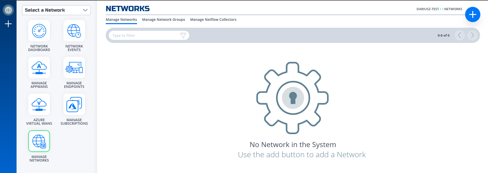
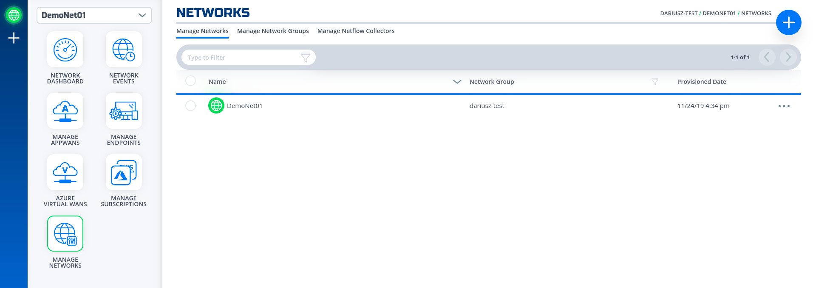

# Overview
This section will show how to do that through [NF Console](https://nfconsole.io), and programatically  using NF Orchestration's APIs

# via Console UI
1. Click on Network Menu
1. Click on "+" button in the top right corner to create a network
1. Give it a name, e.g. "DemoNet01"

1. Wait until the icon network turns green.

1. Done

# via REST API (Python)

!!! note
    For the code clarity, we have broken down the code into multiple Python modules  

    1. [NF REST CRUD (Create,Read, Update and Delete) operations](../api/python/source/netfoundry/nf_requests.py)
    1. [Get MOP Session Token](../api/python/source/netfoundry/nf_token.py)
    1. [Create NF Network](../api/python/source/netfoundry/nf_network.py)
    1. [Wrapper Script to Create NF Resources based on Resource yaml file](../api/python/source/netfoundry/nf_resources.py)

    To obtain a session token, the [MOP Session Token](../api/python/source/netfoundry/nf_token.py) script parses a configuration file
    for clientId, and clientSecret if they are not passed to it through the positional arguments
    (e.g. env, clientId, clientSecret). This configuration file must be located in the home directory under ['~/.env'](../../api/python/etc/env)

1. Clone this repo (git clone https://github.com/netfoundry/mop.git)
1. Change directory to `cd mop`
1. Update [Resource yaml](../api/python/etc/nf_resources.yml) file with the desired options to feed into the wrapper script as described
in the following code snippet.
1. Run this from the root folder
``` python
python3 quickstarts/docs/api/python/nf_resources.py --file quickstarts/docs/api/python/nf_resources.yml
```
Required Configuration Paramters
``` yaml

environment: {NF Console Environment, e.g. Production}
network_action: { e.g. create, get, delete}
network_name: { e.g. DemoNet01 }
```
1. Done

!!! Note
    The logs will be outputted to the log file named logoutput.txt under the directory that the script is run './'.
