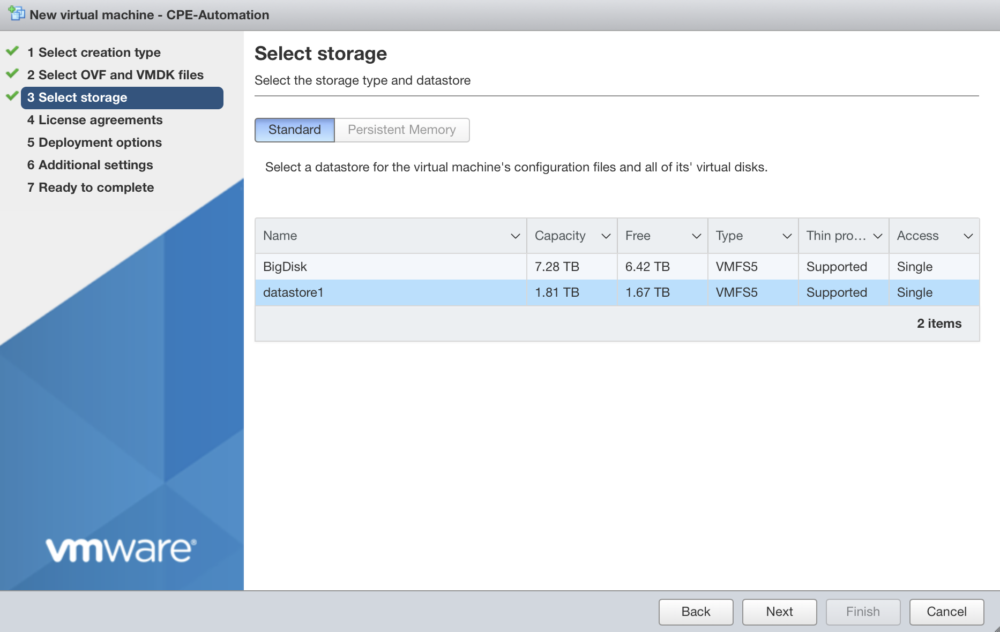
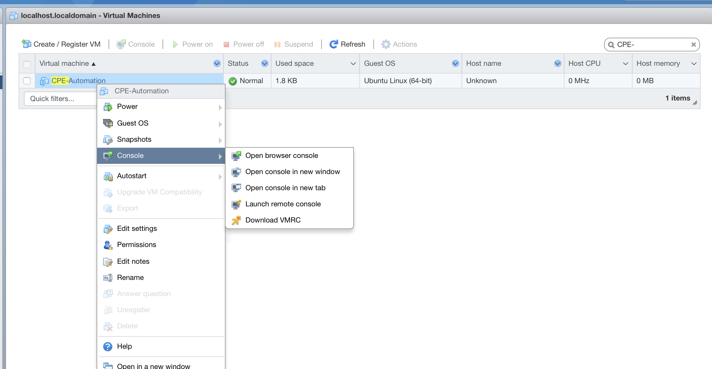
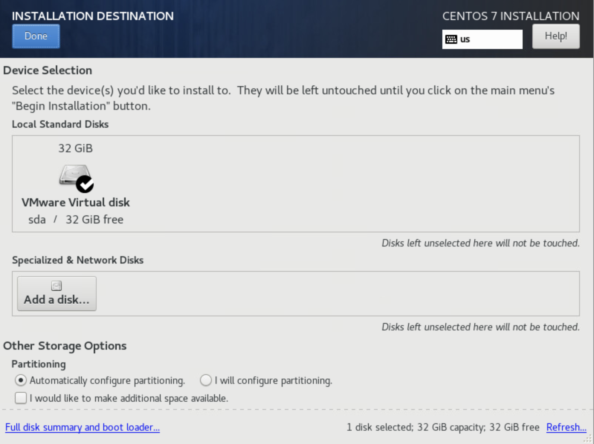

# CPE Automation

Use this procedure to create NF Gateway enabled equipment automatically.

# 1. Summary

## This guide will cover the following sections
<li>Create an automation VM by using OVA provided by NetFoundry. This is a one-time setup.
<li>Install CentOS7 OS on the CPE box.
<li>Run the automation script from the automation VM to setup the CPE box

## This guide will not cover
<li> This guide will <b>only</b> cover deployment of OVA with VMWare6.7, it will not cover all hypervisor out there. However, the provided OVA will work with VM Workstation 12 or EXSi 6.5 or later and VirtualBox.
<li> This guide will not cover how to setup installation media of Cent7 OS. At the end of guide, it will describe where to find the OS image and some tools.

# 2. Create Automation VM

!!! NOTE
    This procedure only needs to execute once for all CPE boxes. It is recommended to create this VM using VMWare hypervisor. 

## Obtain the CPE-Automation OVA

!!! Todo
    We will need to put the OVA somewhere customer can download.

## Create the VM with the OVA

From your hypervisor, create a VM and use the <b>Deploy from OVA</b> option


Hit "<b>Next</b>", and you can choose your OVA image and give a name to the VM you are creating


Hit "<b>Next</b>", it will ask you which storage (Disk) you want to put your VM.  Choose one that suits you.


Hit "<b>Next</b>“ and choose your Network. (Hint, "VM Network" is your default network, that usually is a good choice). For "Disk provisioning", you can leave it at the default choice of "Thin".


Hit "<b>Next</b>", and you are ready to deploy the OVA. Review the content carefully and hit "<b>Finish</b>" to deploy it.


After you hit "<b>Finish</b>", on the Task window, you should notice the VM been created. Once the it reaches 100%, your VM is created.  And it should automatically start after the deployment is done.


## Login and Check the automation VM

Once the VM is completely deployed, we need to make sure the VM is setup correctly.<br>
Go to the main VM window, right click on your VM,<br>
on the popup menu, choose "<b>Console</b>"->"<b>Open browser console</b>".


You will see a console window pop up like this:


Login to the console by using credential <br>
Username: <b>nfadmin</b><br>
Password: <b>nfadmin</b><br>
Check the IP setting by issuing "<b>ip a</b>" command. If you see a valid IP address, then your VM is on a network.


You can verify ssh access to the VM by using a ssh enabled terminal:

    > ssh nfadmin@[ip_address_of_the_automation_vm]

!!! Conclusion
    This is the end of deploying the automation VM.


# 3. Installing CentOS 7 on the CPE

!!! Note
     <b>Have this ready before you start:</b> You will need a CentOS 7 installation media before you start.
     

Insert an Ethernet Cable into your CPE and bootup your CPE via the installation media, you will encounter the first screen:


Choose "<b>Install CentOS 7</b>" to continue.<br>

On the next screen, Choose your Language. And hit "<b>Continue</b>"


The "<b>INSTALLATION SUMMARY</b>" screen will appear.<br>
Check to make sure the step (1) "<b>SOFTWARE SELECTION</b>" is set to "<b>Minimal Install</b>".<br>
Then Click on step (2) "<b>INSTALLATION DESTINATION</b>" to setup the Disk.


Once in the "<b>INSTALLATION DESTINATION</b>" screen<br>
Choose your Disk (NOT the USB installation media)<br>
Click on "<b>Automatically configure partitioning</b>"
Then hit "<b>Done</b>" at the top left screen to continue.  


Once you are back to the "INSTALLATION SUMMARY" screen<br>
Choose step (3) "NETWORK & HOST NAME". The following screen should appear.<br>
Turn on the Ethernet by hitting the button marked (1).<br>
And then observe the IP Address appears below it (at area Marked (2)). (We will need that IP address when we run the automation).<br>
Then hit "<b>Done</b>" at the top left screen to continue.


You should be back to the "INSTALLATION SUMAMRY" screen again, and you can hit "<b>Begin Installation"</b>" to start the Installation.


During the installation, you need to create a user account. For our deployment, you do not need to create root Password. So, press on "<b>USER CREATION</b>" to create an Admin user.


On the "<b>CREATE USER</b>" screen, you need to fill the following:<br>
Username: <b>nfadmin</b><br>
click on "<b>Make this user administrator</b>"<br>
Password: <b>nfadmin</b><br>
You then need to click "<b>Done</b>" twice to exit this screen.  


You will be sent back to the installation screen, wait for it to complete installation, and the "<b>Reboot</b>" button will appear for you to restart the CPE with the CentOS installed.


!!! Conclusion
    This is the end of installing CentOS 7 on the CPE box.


# 4. Run Automation to setup the CPE box

!!! Note
     You will need the IP address of your automation VM and the IP address of your CPE to continue this step

Connect to your automation VM via ssh from a terminal

    > ssh nfadmin@[ip_address_of_the_automation_vm]

Login to the VM by using password: <b>nfadmin</b>

Start the automation by issuing the following command:

    > ./setup-nfnbox.bash [ip_address_of_cpe]

The automation will prompt you to enter<br>
"<b>SSH password</b>" to login to the CPE box (<b>nfadmin</b>)<br>
"<b>BECOME password</b>" (hit <ENTER\> key)


The automation will take a few minutes to complete. At the end of automation, you will see message like this:

```
PLAY RECAP ******************************************************************************************************************
10.111.111.1               : ok=6    changed=3    unreachable=0    failed=0    skipped=0    rescued=0    ignored=0
192.168.1.184              : ok=35   changed=28   unreachable=0    failed=0    skipped=2    rescued=0    ignored=0
```

!!! Conclusion
    The CPE is now setup and ready.


# 5. CentOS 7 Installation Media

!!! Disclaimer
    There are many ways to obtain and setup the installation media. If you never set one up before, the quickest and easiest way to create one is by downloading the OS image and burn it to a USB by using disk utility.

## CentOS 7 image

You can obtain a copy of OS image by visiting centos.org. But since you need to get a CentOS 7 image (not the latest CentOS 8), here is a quick link to Cent7OS mirror sites: <br>

```
http://isoredirect.centos.org/centos/7/isos/x86_64/
```

Recommend download the "CentOS-7-x86_64-DVD-xxxx.iso" (around 4.5G). This is the image tested.  Since we use minimal installation from CentOS 7, so the minimal image should work also "CentOS-7-x86_64-Minimal-xxxx.iso" (around 1G)<br>

## Burn Image to a USB stick

You can burn the image to a USB stick by using Rufus (if you are on a PC). You can find many tutorials on the internet if you have trouble
